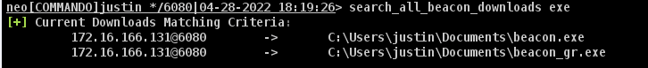
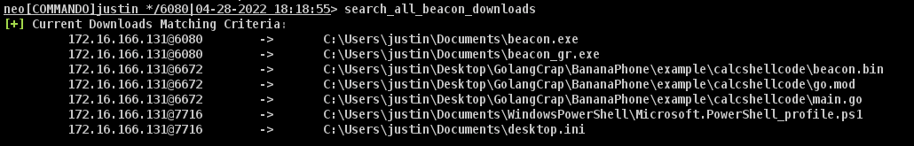
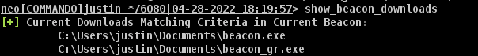
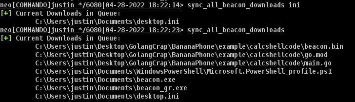
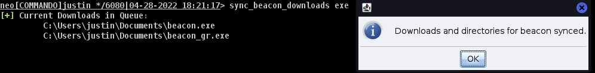
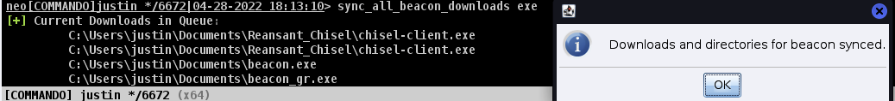

# Sync Downloads
This is meant as a fine-tuned control mechanism for syncing files from the `Cobalt Strike` `Downloads` entries in the data model

## Why
1. Searching
    - You can retrieve everything, user-supplied needles from the context of your current `Beacon`'s known downloads or at a "global" downloads scale
2. Context maintenance
    - Whether from a `UNC` path or a "local" system filepath, your *full* directory path will be maintained

## Prerequisities
1. You *must* run the `set_sync_location` command with an arugment of where you would like the *base* of the directory structure to be written
    - There is a sanity check that will determine if the provided location is valid
        - If this returns false, you will be warned and the path will *not* be saved for future use
    - There is a courtesy function, `show_sync_location` that you can use to determine the current (or prior) path you had set the download location to 

## Other Features
1. This script, as it is client-side, means every connection to your `TeamServer` is unique, meaning `set_sync_location` is on a per-`TeamServer` basis
    - Stop fighting managing your donwloads, and keep yourself from unintentionally crossing streams!
 
## Usage
| Beacon_Command                | Description                   | Example Usage                                                             |
| ----------------------------- | ----------------------------- | ------------------------------------------------------------------------- |
| `show_beacon_downloads`       | Show current beacon downloads      | `show_beacon_downloads [optional_search]`             |
| `search_all_beacon_downloads` | Show all beacon downloads     | `search_all_beacon_downloads [optional_search]` |
| `sync_all_beacon_downloads`   | Sync all beacon downloads     | `sync_all_beacon_downloads [optional_search] [OVERWRITE]`    |
| `sync_beacon_downloads`       | Sync current beacon downloads | `sync_beacon_downloads [optional_search] [OVERWRITE]`             |

## Footgun Prevention
By default, any encountering of previously downloaded files in a path will *not* be downloaded again.

To override this behavior, you ***must*** specify `OVERWRITE` as a third argument to `sync.*` commands.

## Mulitiple Matching
As the supplied parameter for an optional search is present, you can think of this as a possible `regex` filter (because it is).

## Examples
`show_beacon_downloads "(.exe|.bin)"` will search `Downloads` associated with the current `Beacon` matching `exe` or `bin`

`show_beacon_downloads` will search and list all `Downloads` associated with the current `Beacon`

`search_all_beacon_downloads "(.exe|.bin)"` will search `Downloads` associated with *all* `Beacon`s matching `exe` or `bin` 

`search_all_beacon_downloads` will search and list all `Downloads` associated with *all* `Beacon`s

`sync_beacon_downloads` will search `Downloads` associated with the current `Beacon` and create a directory structure, ignoring if files are already present

`sync_beacon_downloads "(.exe|.bin)"` will search `Downloads` associated with the current `Beacon` matching `exe` or `bin` and create a directory structure, ignoring if files are already present

`sync_beacon_downloads "(.exe|.bin)"` will search `Downloads` associated with the current `Beacon` matching `exe` or `bin` and create a directory structure, ***overwriting*** files if they are already present

`sync_all_beacon_downloads` will search `Downloads` associated with ***all*** `Beacon`s and create a directory structure, ignoring if files are already present

`sync_all_beacon_downloads "(.exe|.bin)"` will search `Downloads` associated with ***all*** `Beacon`s matching `exe` or `bin` and create a directory structure, ignoring if files are already present

`sync_all_beacon_downloads "(.exe|.bin)"` will search `Downloads` associated with ***all*** `Beacon`s matching `exe` or `bin` and create a directory structure, ***overwriting*** files if they are already present

## Sample Outputs

